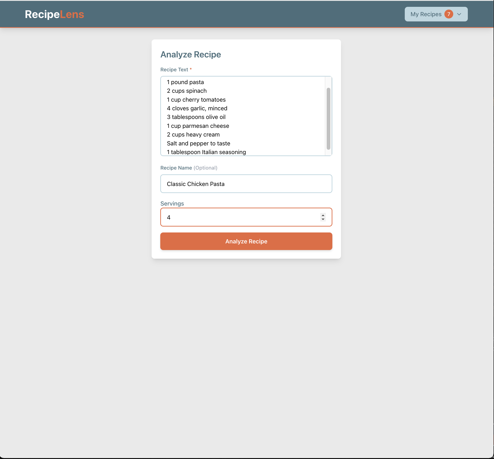
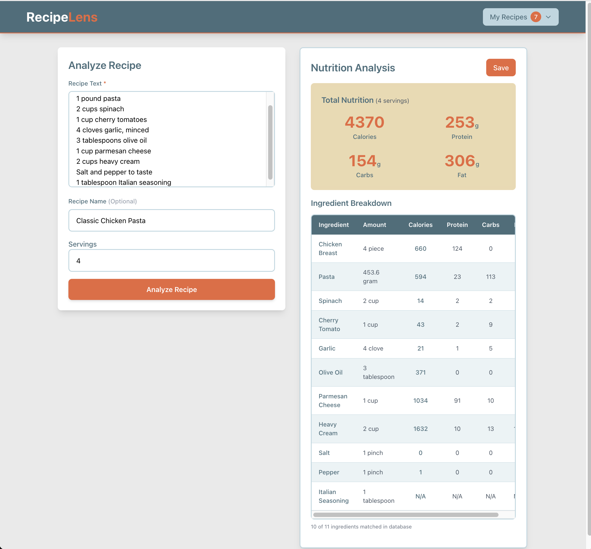
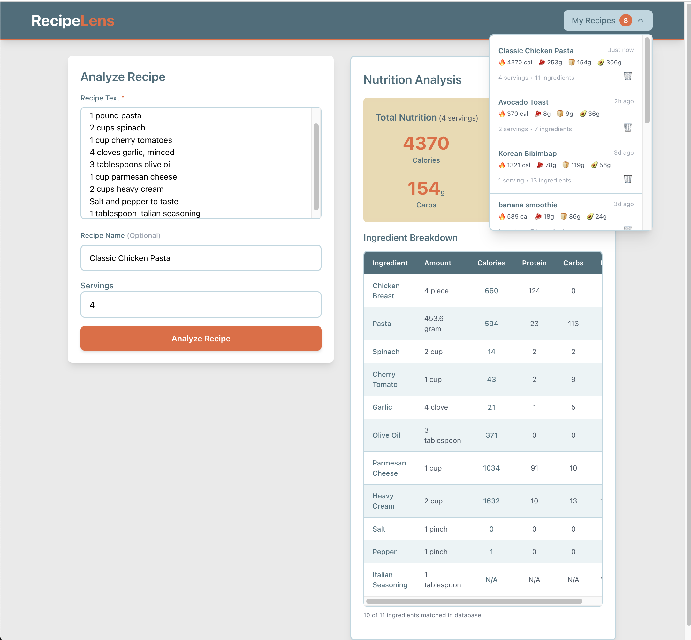
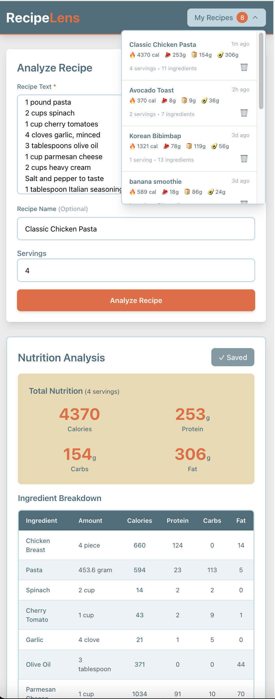

# 🍳 RecipeLens

## 🌐 Live Demo

**[View Live Demo](https://recipe-lens-erhr.vercel.app/)**


AI-powered recipe nutrition analyzer that transforms any recipe text into detailed nutrition information. 

## 📖 Overview

RecipeLens uses OpenAI's GPT-4 to parse recipe ingredients and calculate comprehensive nutritional information. Simplay paste your recipe, and get instand analysis of calories, protein, carbs, and fat for each ingredient and the entire dish. 

## ✨ Features

- 🤖 **AI-Powered Parsing**: Automatically extracts ingredients, quantities, and units from recipe text
- 📊 **Comprehensive Nutrition Analysis**: Calculates calories, protein, carbs, and fat per ingredient and total 
- 🍽️ **Serving Size Support**: Input number of servings for accurate per-serving nutrition
- 🔄 **Smart Unit Conversion**: Handles cups, tablespoons, teaspoons, grams, ounces, pounds, and more
- 🗄️ **Ingredient Database** 70+ common foods with accurate USDA nutrition data
- 💾 **Save & Manage**: Store your analyzed recipes for future reference
- 📱 **Responsive Design**: Clean, modern UI built with React and Tailwind CSS

## 🛠️ Tech Stack

### Frontend
- React
- Tailwind CSS
- Axios

### Backend
- Node.js
- Express
- MongoDB
- Mongoose
- OpenAI API (GPT-4o mini)

## 🚀 Getting Started

### Prerequisites

- Node.js
- MongoDB
- OPenAI API key

### Installation

1. **Clone the repository**
```bash
git clone https://github.com/nikki-builds/RecipeLens.git
cd recipelens
```

2. **Install dependencies**

Backend:
```bash
cd backend
npm install
```

Frontend:
```bash
cd frontend
```

3. **Environment Variables**

Create a `.env` file in the `backend` directory with the following variables:
```env
MONGODB_URI=your_mongodb_connection_string
OPENAI_API_KEY=your_openai_api_key
PORT=3001
```

4. **Seed the databse**
```bash
cd backend
npm run seed
```

5. **Start the application**

Backend:
```bash
cd backend
npm run dev
```
Frontend (in a new terminal):
```bash
cd frontend
npm start
```

The app will open at `http://localhost:3001`

## 💡 Usage

1. **Enter Recipe**: Paste or type your recipe into the text box
2. **Add Details** (Optional): Enter recipe name and number of servings
3. **Analyze**: Click "Analyze Recipe" to get nutrition breakdown
4. **Review**: View detailed calories, protein, carbs, and fat for each ingredient
5. **Save**: Click "Save" to store the recipe
6. **Manage**: Access saved recipes via "My Recipes" (top right corner)
7. **Delete**: Remove recipes by clicking "Delete"

## 📸 Screenshots

## 📸 Screenshots

<div align="center">

### Main Interface

<p><em>Clean, intuitive recipe input interface</em></p>

### Recipe Analysis

<p><em>Detailed nutrition breakdown with matched ingredients</em></p>

### Saved Recipes

<p><em>Easy access to saved recipes</em></p>

### Mobile Responsive Design

<p><em>Fully responsive design for mobile devices</em></p>

</div>

## 🎯 How It Works

1. **Recipe Input**: User pastes recipe text
2. **AI parsing**: OpenAI extracts structured ingredient data (quantitiy, unit, ingredient name)
3. **Database Matching**: Backend searches MongoDB for matching foods
4. **Nutrition Calculation**: Converts units to grams and scales nutrition data per ingredient
5. **Display Results**: Frontend shows complete nutritional breakdown

## 📊 Features in Detail

### Smart Unit Conversions
- **Volume**: cups, tablespoons, teaspoons
- **Weight**: grams, ounces, pounds
- **Pieces**: whole items (eggs, bananas, chicken breast)
- **Seasonings**: pinch, dash, "to taste"

### 🔮 Ingredient-Sepcific Cup Weights
RecipeLens uses accurate cup-to-gram conversions for common ingredients:
- 1 cup oats = 80g
- 1 cup milk = 244g
- 1 cup broccoli = 71g
- And more...

## Future Enchancements

- [ ] Meal planning features
- [ ] Export recipes to PDF
- [ ] Recipe scaling after analysis (adjust servings dynamically)
- [ ] Dietary filters (vegan, gluten-free, etc)
- [ ] Expand ingredient dabatase
- [ ] Recipe image upload with OCR (Optical Character Recognition)
- [ ] Nutritional goals tracking

## 📝 License
MIT License

## 👤 Author

**Na Yeon (Nikki) Kim**
- Transitioning from nutrition background to tech
- Combining nutrition expertise with full-stack development

## 🙏 Acknowledgments

- OpenAI for GPT-4o-mini API
- USDA FoodData Central for nutrition information
- Tailwind CSS for styling framework

